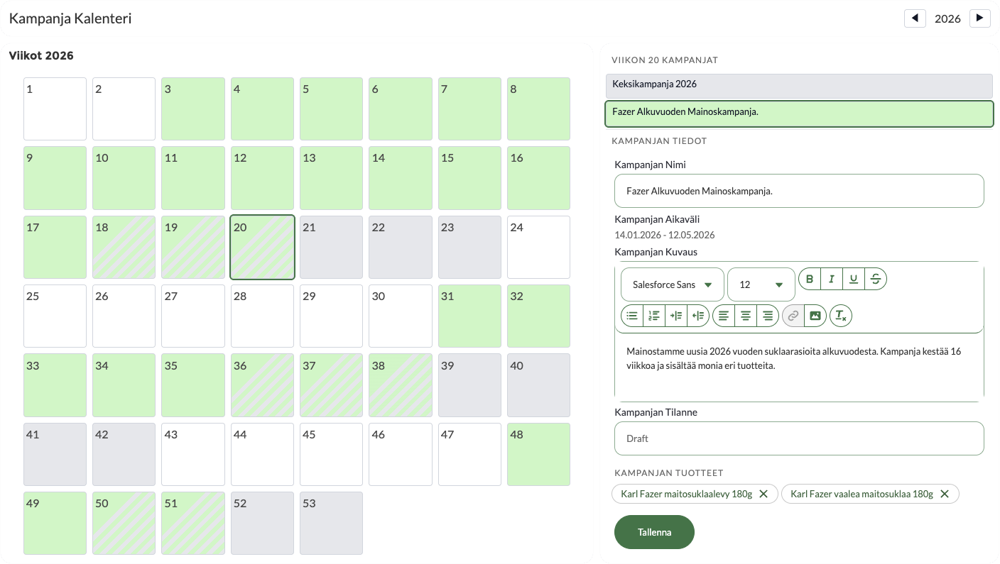
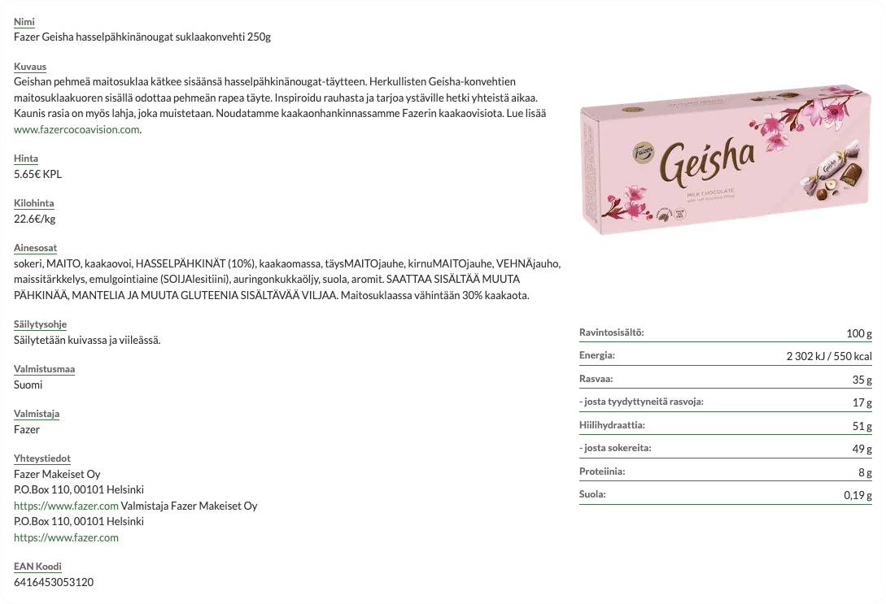
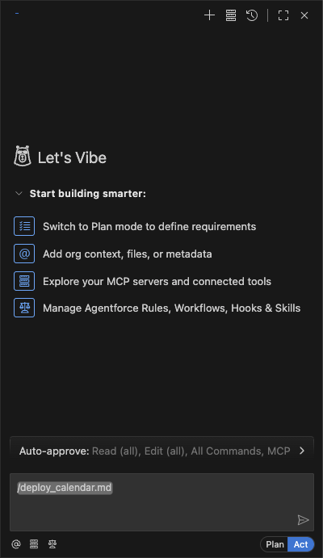
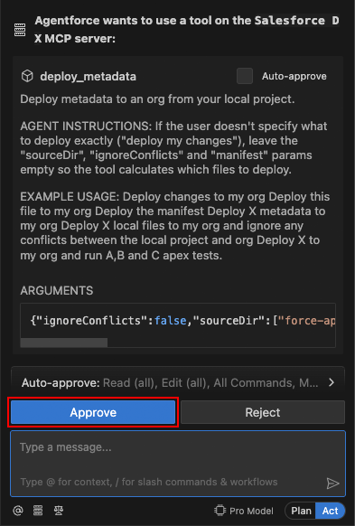
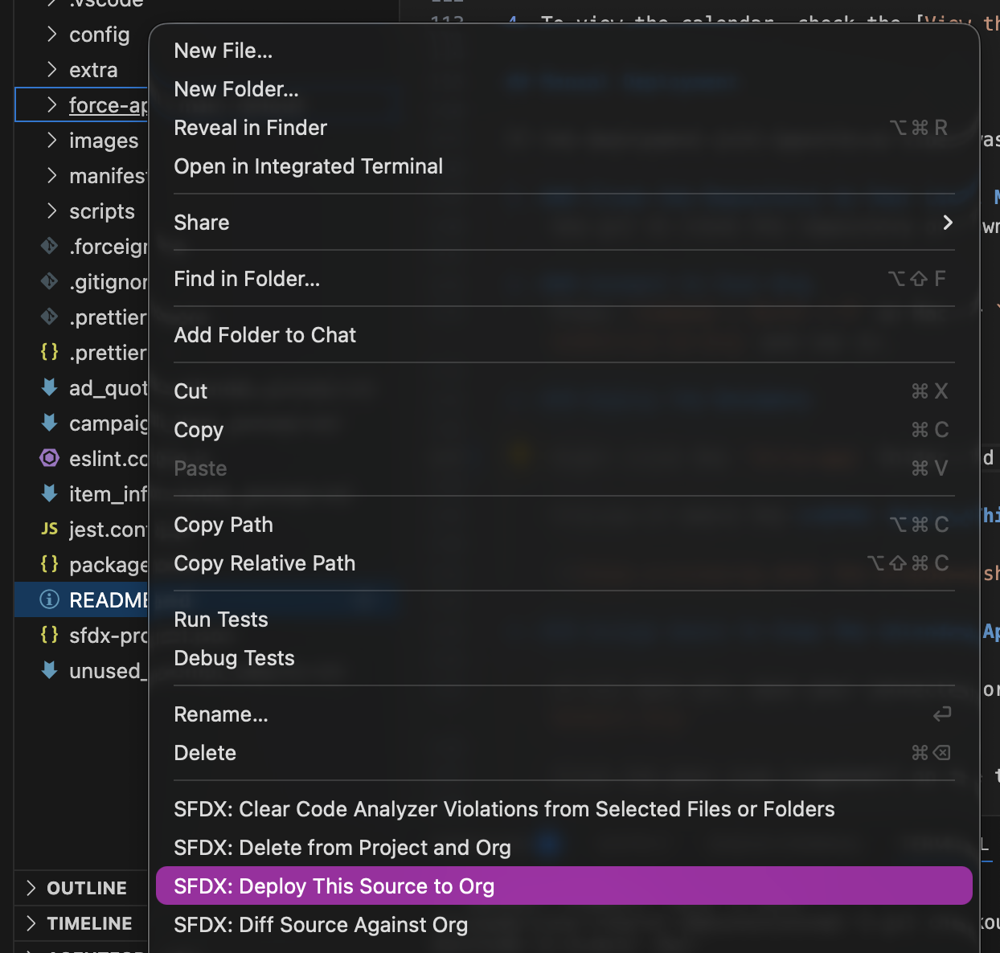
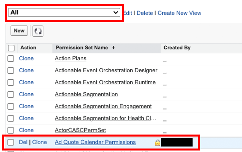
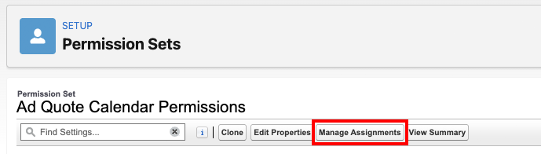
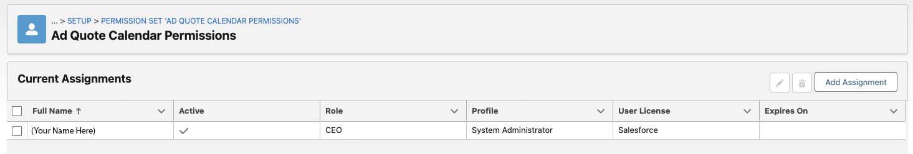
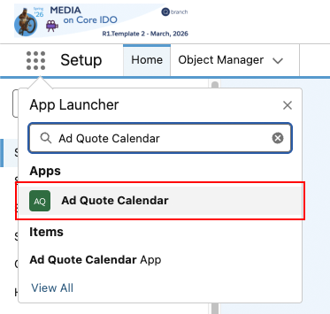
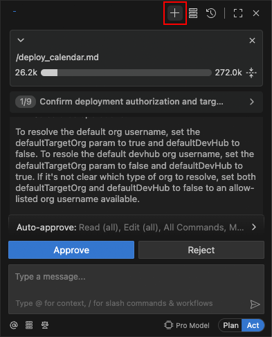

# Salesforce Ad Quote Calendar

This project's base was made using Salesforce's Agentforce Vibes AI co-pilot.
A lot of the LWC code is generated by prompting Vibes AI in natural language.
The rest of the code is written and tweaked by hand.



## Table of Contents

- [Description](#description)
- [Highlights](#highlights)
- [Deployment Guide](#deployment-guide)
- [Deployment Troubleshooting](#deployment-troubleshooting)

## Description

A Lightning Web Component Calendar to visualize advertisement campaigns that belong to the currently logged-in user inside the Salesforce platform. 

The calendar shows years in week-based cells that are colored based on the campaigns or events happening during them. Green-colored cells indicate that the user has campaigns during that week, gray-colored cells indicate that the week has other events during it.

The campaigns and campaign items are records of custom Salesforce objects. Users can edit and save the details of their campaigns inside the calendar component.

Items related to the campaigns are also record-based but only reference a product's EAN code. The calendar will call an Apex function to scrape product data based on the code from an online store.

## Highlights

Highlighted complex components of the project that were manually developed.

### EAN Scraper Service

Apex service [EanScraperService.cls](force-app/main/default/classes/EanScraperService.cls) is used for scraping data using an HTTP request.

The HTTP request is made to the store's page by adding the EAN code to the path of the URL.

The website always sends a status of 308 for permanent redirect where the path gets appended with the product's name. The service will follow the redirect until it gets a success status of 200.

Once the HTML body is successfully retrieved, the service will find the script element that conveniently contains all of the data for the page inside it.

The service parses the received JSON section of the script into a String-Object Map to read the data more efficiently.

[Item Info Utils](#item-info-utils) calls the service's `fetchProductDetailsJsonFromEanCode()` to receive all of the data that is relevant to the product in a serialized JSON string.

### Item Info Utils

JavaScript utility file [itemInfoUtils.js](force-app/main/default/lwc/itemInfoUtils/itemInfoUtils.js) contains the helper classes ProductDataHandler, ProductDataFormatter and ProductDataManager.

ProductDataHandler handles the fetching of product data based on the given EAN code. Once the fetching is complete, the data can be read through the exposed helper methods inside the ProductDataHandler.

ProductDataFormatter contains helper methods to create data entry objects that include a title and a value. These data entry objects are then read within the [Item Info View](#item-info-view).

ProductDataManager is a child class of ProductDataHandler but also includes ProductDataFormatter inside it that is linked to this ProductDataManager from the moment of creation.

### Item Info View

Secondary Lightning Web Component [itemInfoView](force-app/main/default/lwc/itemInfoView) is used for displaying specified data of a product based on the inputs of the component.

The component takes input parameters for EAN code, preview image width & height and a comma-separated string of the details to be shown. For example [simpleItemInfoView](force-app/main/default/lwc/simpleItemInfoView) is just a wrapper component of this component but exposes only a few specific details of the product.

For all the details that the Item Info View can show, see the getter `allDetailTags()` inside [itemInfoView.js](force-app/main/default/lwc/itemInfoView/itemInfoView.js)



# Deployment Guide

[Resources for installing VSCode for Salesforce DX projects](https://developer.salesforce.com/docs/platform/sfvscode-extensions/overview)

You will need to have your Visual Studio Code set up with Salesforce's extensions to deploy this project.

## ORG REQUIREMENTS

This project requires the following objects:
- Product2
- AdSpaceSpecification
- MediaChannel

For demo org templates, you should use Media on Core IDO template.


## Deploying the Component to Your Org (Agentforce Vibes Workflow)

*Disclaimer: This is a demo project component and should not be deployed into a production org unless you know the component thoroughly!*

1. ### Clone the Repository to Your Local Machine
    Use git to clone the repository or download it and open it in Visual Studio Code.

2. ### Connect to Your Org
    Press `Command + Shift + P` on Mac or `Control + Shift + P` on Windows to bring up the Command Palette. Search for the command `SFDX: Authorize an Org` and run it.

3. ### Deploy Using Agentforce Vibes Workflow

    **IF AGENTFORCE VIBES RUNS INTO ISSUES, USE THE [MANUAL DEPLOYMENT STEPS](#manual-deployment)**

    Open the Agentforce Vibes chat inside your Visual Studio Code and run the command:

    ```sh
    /deploy_calendar.md
    ```

    Preview of what giving the deploy command should look like in the chat window:

    

    Agentforce Vibes will ask your permission to deploy metadata, keep pressing **Approve** as long as the tool Vibes is trying to use is **deploy_metadata**

    Preview of the chat window when Agentforce Vibes is asking for deployment permission:

    

    If the workflow was successfully run, the Lightning Web Components and the required custom objects and permissions should be deployed to your connected org.

4. To view the calendar, check the [View the Ad Quote Calendar App](#view-the-ad-quote-calendar-app)

## Manual Deployment

If the deployment with Agentforce Vibes was unsuccessful, you can follow these steps to manually deploy the project to your org.

1. ### Clone the Repository to Your Local Machine
    Use git to clone the repository or download it and open it in Visual Studio Code.

2. ### Connect to Your Org
    Press `Command + Shift + P` on Mac or `Control + Shift + P` on Windows to bring up the Command Palette. Search for the command `SFDX: Authorize an Org` and run it.

3. ### Deploy The Metadata

    These steps will make sure that the metadata is deployed in the right order. Otherwise the deployment might fail because of missing dependencies.

    1. **Deploy Global Value Sets** 
    
        Right click the folder `force-app/main/default/globalValueSets` and select **SFDX: Deploy This Source to Org**

    2. **Deploy Objects**
    
        Right click the folder `force-app/main/default/objects` and select **SFDX: Deploy This Source to Org**

    3. **Deploy Apex Classes**
    
        Right click the folder `force-app/main/default/classes` and select **SFDX: Deploy This Source to Org**

    4. **Deploy Lightning Web Components**
    
        Right click the folder `force-app/main/default/lwc` and select **SFDX: Deploy This Source to Org**

    5. **Deploy Rest of the Metadata**
    
        Finally right click the `force-app` folder and select **SFDX: Deploy This Source to Org**

    Preview of where the **SFDX: Deploy This Source to Org** is located on the dropdown menu:

    

4. ### Assign Users To View The Calendar App

    If not open yet, open your connected org with `Command + Shift + P` on Mac or `Control + Shift + P` on Windows and running `SFDX: Open Default Org`

    Click the gear icon (cogwheel) on the top right and go to `Setup` and search for `Permission Sets` in the Quick Find.

    Find and click the `Ad Quote Calendar Permissions` permission set. If you cannot see the permission set, select `All` from the dropdown menu to show all permission sets.

    

    Click `Manage Assignments` and then `Add Assignment`

    

    Select yourself and anyone else needed from the list using the checkboxes on the left.

    Click `Next` and then `Assign`

    You should now see yourself in the list of people who have the permission set assigned to them.

    

## View the Ad Quote Calendar App

Press `Command + R` on Mac or `Control + R` on Windows to refresh your browser window.

Click the App Launcher from the top left corner and search for `Ad Quote Calendar`



Click the `Ad Quote Calendar` to open the application with a tab containing the calendar component.


# Deployment Troubleshooting

### Agentforce Vibes is Stuck Deploying or Could Not Deploy the Project

Agentforce Vibes might have slight randomness when running workflows, try to run the workflow again in a new chat by pressing the `+` Sign at the top of the chat window.



If the deployment is still running into issues please follow to the [Manual Deployment Steps](#manual-deployment)

### Metadata Still Does Not Deploy

Metadata deployment could fail because of the following reasons:

- Metadata was not deployed in the right order. Make sure to follow the order in [Deploy The Metadata](#deploy-the-metadata)
- The org that you're trying to deploy to, does not include the needed objects. See [ORG REQUIREMENTS](#org-requirements)

### Metadata Deployed but Ad Quote Calendar is Not Visible

Make sure you have followed the steps at [Assign Users To View The Calendar App](#assign-users-to-view-the-calendar-app) to make sure you have access to see the calendar app.